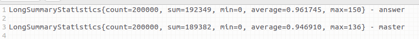

# Pixel Battles

## Постановка задачи

Дана карта 100х100, реализовано REST API для окрашивания клетки в цвет.
Исходно карта выполнена в виде одномерного массива и доступ к нему осуществляется из критической секции.

Требуется оптимизировать конкурентный доступ к карте. Структуру данных для хранения поля можно изменить по вашему
усмотрению.

Помимо технической реализации проекта, потребуется ниже описать вашу идею оптимизации и примененные техники.

В тестах приведен пример нагрузочного тестирования. Прежде чем приступать к заданию, стоит замерить производительность
образца.
И затем сравнивать результаты после оптимизации.

## Описание идеи

Избавиться от synchronized методов для получения и отрисовки карты. Есть методы для чтения и записи. Запретить
одновременно потокам читать и записывать, но при этом, одновременно могут читать неограниченное количество потоков и
дать доступ записывать до (height * width) потоков. Таким образом мы избавимся от "узкого горлышка". Для синхронизации
записи и чтения воспользовался массивом ReadWriteLock-ов (см. реализацию)

Решение:

1) Добавить в MapService массив локов (ReadWriteLock)
2) При записи блокировать WriterLock из массива локов
3) При чтении блокировать ReaderLock из массива локов

Результат:

